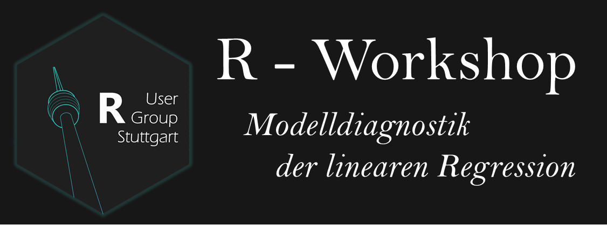
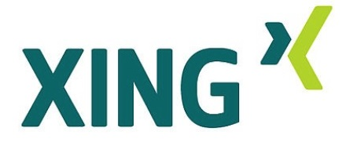

# R User Group Stuttgart - Sitzung am 30.11.2017

**Thema: Modelldiagnostik**

Hallo, wilkommen zum GitHub Repository für die Sitzung am 30.11.2017 :)
*Modelldiagnostik.*

Die Modelldiagnostik dient dazu die Validität und Reliabilität der Ergebnisse einer linearen Regression sicherzustellen. Wenn alle Annahmen erfüllt sind, kann man von einer bestmöglichsten Parameterschätzung sprechen, was auch Best Linear Unbiased Estimator genannt wird (BLUE, siehe Gauß-Markov-Theorem). In diesem Workshop lernt ihr die Grundkonzepte der Modelldiagnostik für lineare Modelle, deren Anwendung sowie Interpretation und Visualisierung. Alles in R!

#### **Links zum dieswöchigen `learnr`:**

[LearnR: Instance 1](https://favstats.shinyapps.io/regdiag1/)

[LearnR: Instance 2](https://favstats.shinyapps.io/regdiag2/)

[LearnR: Instance 3](https://favstats.shinyapps.io/regdiag3/)

#### **Kontakt:**

Wir haben jetzt auch eine [XING-Gruppe](https://www.xing.com/communities/groups/r-user-group-stuttgart-c0de-1101184)

 
 
 
 

Oder tretet unserer Gruppe auf [Facebook](https://www.facebook.com/groups/rstuttgart/) bei

 
 

